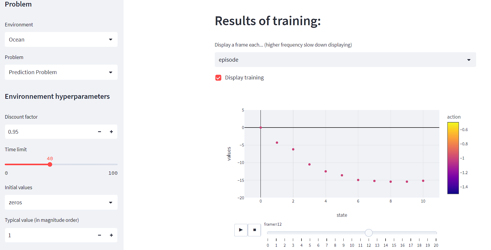

# Formation-Reinforcement-Learning
This is the repository for the Reinforcement Learning course at Automatants, the AI student association of CentraleSupélec. The course was given to students of the CentraleSupélec campus as an introduction to Reinforcement Learning.

<p align="center">
  
</p>

Concepts covered in the first part (slides 1-39):
- RL Framework (Environment (with examples), MDP, Policy, Cumulative reward, State and Action Value)
- Environnement shaping (Reward shaping, State shaping, Action shaping)
- Prediction and Control problems
- Model-based methods : Dynamic Programming (Bellman Equations, Policy Iteration, Value Iteration)

Concepts covered in the second part (slides 40-80):
- Model-free methods : Monte Carlo, TD Learning (SARSA, Q-Learning, Expected SARSA), n-step TD Learning
- Exploration-Exploitation Dilemma
- Exploration Replay
- Deep RL introduction
- Deep Q Network (DQN)
- Parallelization in RL
- Librairies and ressources in RL

Policy-based RL methods and Importance Sampling are also covered in the slides (81 - 88), but not in the lectures.


## Videos

Videos of the lectures are available (in French only) on the [Automatants Youtube channel](https://www.youtube.com/channel/UCZ2wKX6bJg9Yz9KdHkzjw1Q).

Part 1: Introduction to Reinforcement Learning and Model-based methods (RL Framework, Bellman Equations, Dynamic Programming)

- [Lecture 1: Introduction to Reinforcement Learning](https://www.youtube.com/watch?v=9Z6Z5Z0Zzq8)

Part 2: Model-free methods and deeper concepts in RL : Monte Carlo, TD Learning (SARSA, Q-Learning, Expected SARSA), Exploration-Exploitation Dilemma, Off-Policy Learning, Deep RL intro

- [Lecture 2: Deeper concepts in Reinforcement Learning](https://www.youtube.com/watch?v=9Z6Z5Z0Zzq8)

## Slides 

Slides of the lectures are available in this repository in French and English in the as powerpoint files "slides ENGLISH.pptx" and "slides FR.pptx".

<p align="center">
  
</p>


## Gridworld environment

<p align="center">
  
</p>

The Gridworld environment is available [here](https://github.com/tboulet/gridworld_rl). It was a simple gridworld environment developped to implement the algorithms seen in the lectures. The goal was to visualize Q values or probabilities of actions during the training of the agent. Several environments/grids (with different rewards, obstacles, etc.) and several agents (including your own) are available. More information on the GitHub repository.

## Streamlit app

You can visualize the results of the algorithms seen in the lectures and the influence of many hyperparameters with the Streamlit app. 

This include 3 environnements : OceanEnv (reach the goal as fast as possible), Nim (take the last stick) and a Contextual Bandit environment (choose the best arm at each state).
<p align="center">
  
</p>

The app is deployed with Streamlit and should be available [here](https://share.streamlit.io/tboulet/formation-reinforcement-learning/main/app.py).

If that is not the case, you can still install streamlit with pip and then run the app locally with the following command:
```bash
streamlit run streamlit_app.py
```